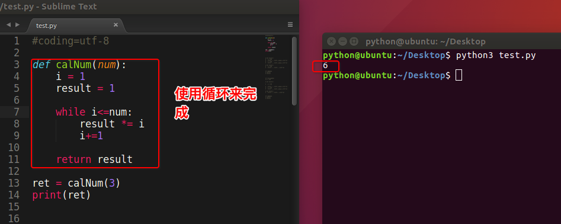
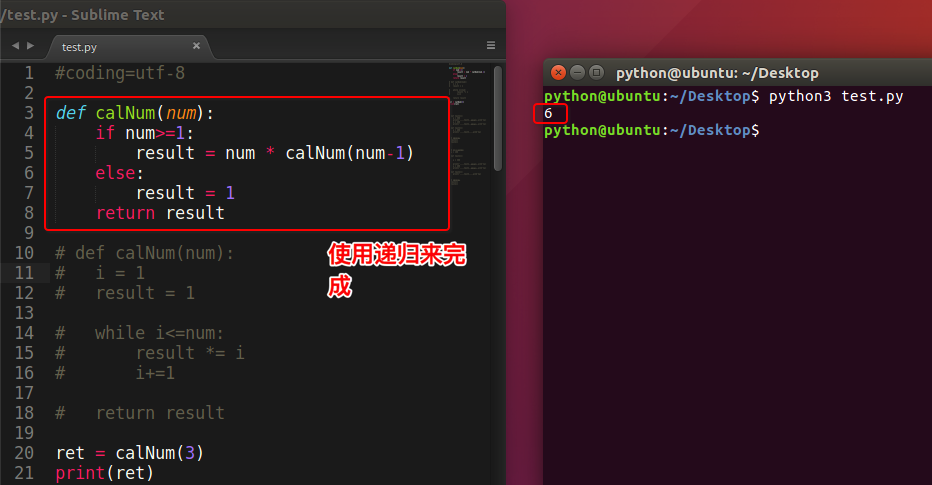
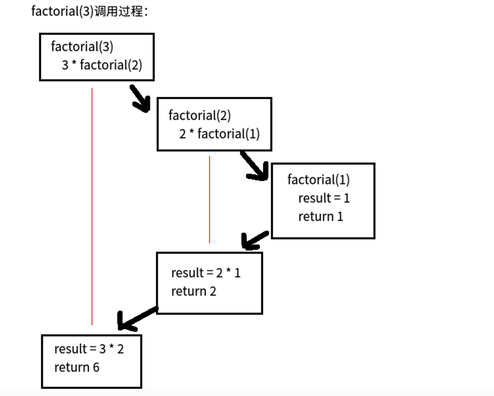

## 递归函数

### <1>什么是递归函数

通过前面的学习知道一个函数可以调用其他函数。

如果一个函数在内部不调用其它的函数，而是自己本身的话，这个函数就是递归函数。

### <2>递归函数的作用

举个例子，我们来计算阶乘 `n! = 1 * 2 * 3 * ... * n`

解决办法1:



##### 看阶乘的规律

````
1! = 1
2! = 2 × 1 = 2 × 1!
3! = 3 × 2 × 1 = 3 × 2!
4! = 4 × 3 × 2 × 1 = 4 × 3!
...
n! = n × (n-1)!
````

解决办法2:



原理


