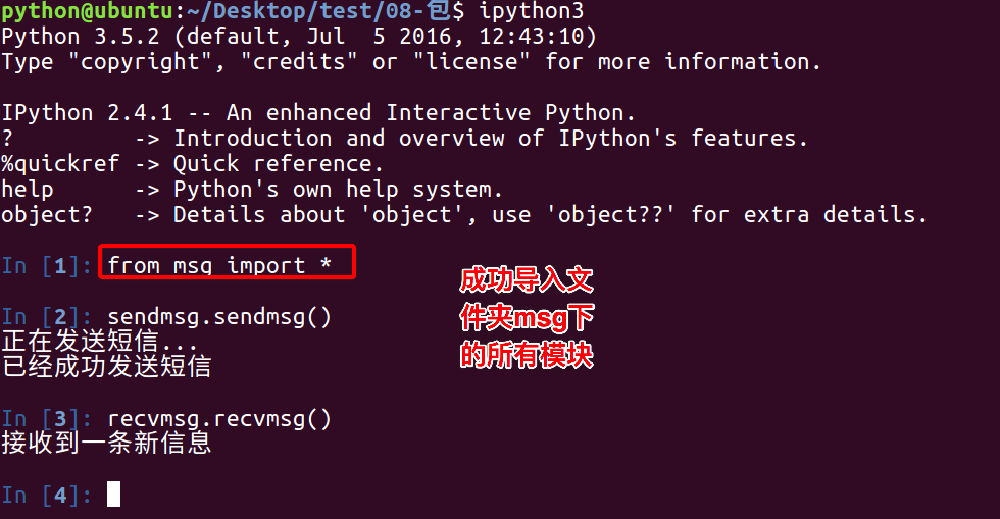
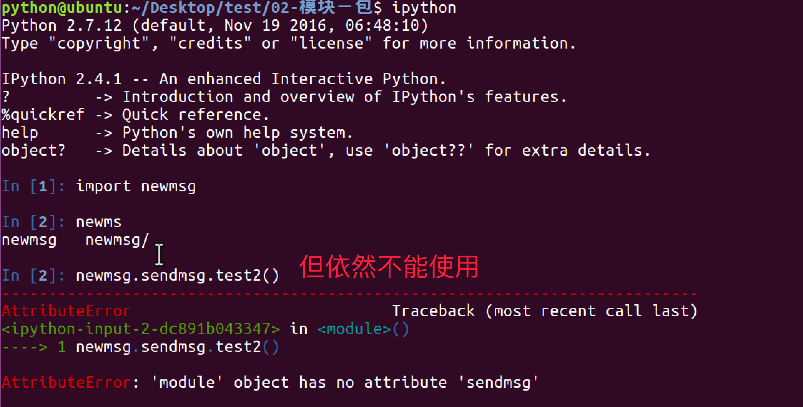
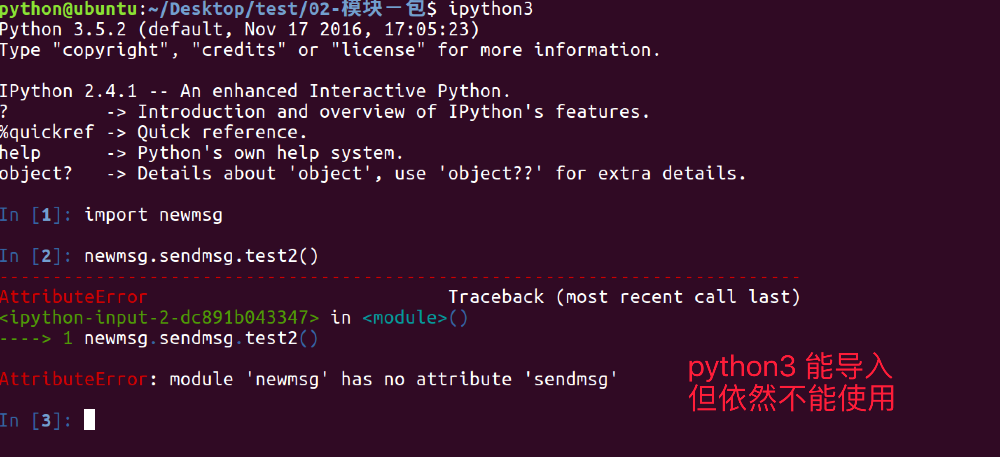
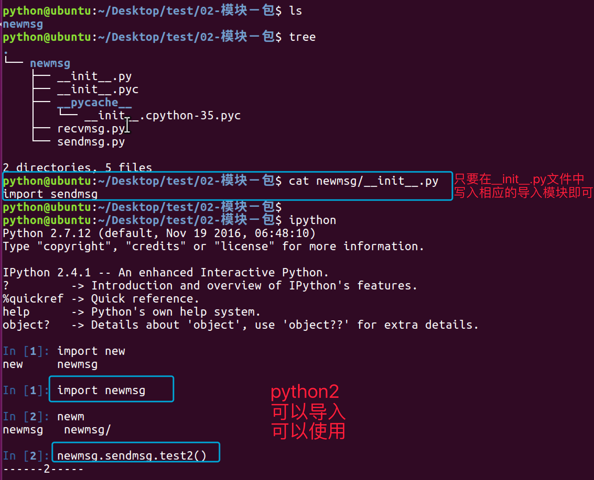

# python中的包

## 1. 引入包

### 1.1 有2个模块功能有联系

### 1.2 所以将其放到同一个文件夹下

### 1.3 使用import 文件.模块 的方式导入

### 1.4 使用from 文件夹 import 模块 的方式导入

### 1.5 在msg文件夹下创建`__init__.py`文件

### 1.6 在`__init__.py`文件中写入

### 1.7 重新使用from 文件夹 import 模块 的方式导入

## 总结：

* 包将有联系的模块组织在一起，即放到同一个文件夹下，并且在这个文件夹创建一个名字为`__init__.py` 文件，那么这个文件夹就称之为`包`
* 有效避免模块名称冲突问题，让应用组织结构更加清晰

## 2. `__init__.py`文件有什么用

`__init__.py` 控制着包的导入行为

### 2.1 `__init__.py`为空

仅仅是把这个包导入，不会导入包中的模块

### 2.2 `__all__`

在`__init__.py`文件中，定义一个`__all__`变量，它控制着 from 包名 import \*时导入的模块

### 2.3 可以在`__init__.py`文件中编写内容

可以在这个文件中编写语句，当导入时，这些语句就会被执行

`__init__.py文件`  

### 2.4 可以控制导入其他模块

目录结构  

sendmsg.py 和 recvmsg.py文件中的内容  

python2导入失败  

python3导入成功，但是不能使用模块  

在文件夹下创建一个文件  

python2导入成功，但不能使用  

python3导入成功，但不能使用  

解决python2不能使用的方式  

python2的解放方式对python3不生效  

解决python3不能使用的方式  

