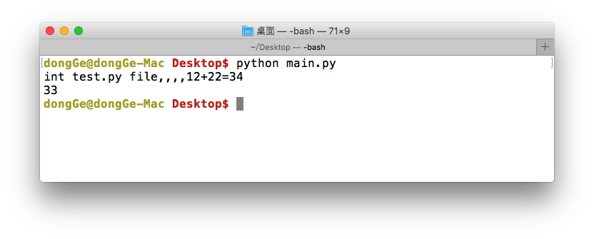
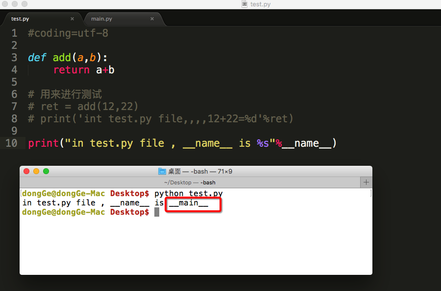
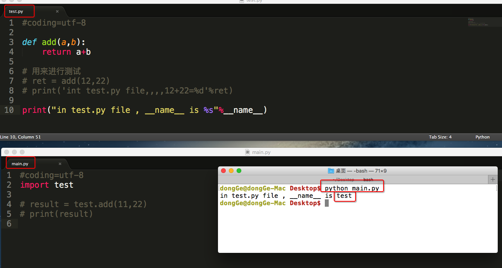
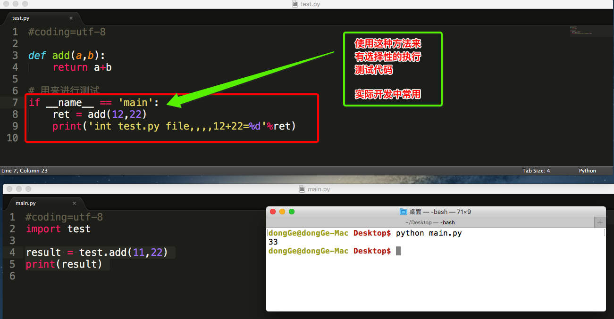

# 模块制作

## 1. 定义自己的模块

在Python中，每个Python文件都可以作为一个模块，模块的名字就是文件的名字。

比如有这样一个文件test.py，在test.py中定义了函数add

test.py
```python

	def add(a,b):
	    return a+b
```

## 2. 调用自己定义的模块

那么在其他文件中就可以先import test，然后通过test.add(a,b)来调用了，当然也可以通过from test import add来引入


main.py
```python

	import test

	result = test.add(11,22)
	print(result)

```

## 3. 测试模块

在实际开中，当一个开发人员编写完一个模块后，为了让模块能够在项目中达到想要的效果，这个开发人员会自行在py文件中添加一些测试信息，例如：

`test.py`

```python

    def add(a,b):
        return a+b

    # 用来进行测试
    ret = add(12,22)
    print('int test.py file,,,,12+22=%d'%ret)
```

如果此时，在其他py文件中引入了此文件的话，想想看，测试的那段代码是否也会执行呢！

`main.py`

```python

    import test

    result = test.add(11,22)
    print(result)

```

运行现象：



至此，可发现test.py中的测试代码，应该是单独执行test.py文件时才应该执行的，不应该是其他的文件中引用而执行

为了解决这个问题，python在执行一个文件时有个变量`__name__`

### 直接运行此文件



### 在其他文件中import此文件



#### 总结：
* 可以根据\_\_name\_\_变量的结果能够判断出，是直接执行的python脚本还是被引入执行的，从而能够有选择性的执行测试代码


