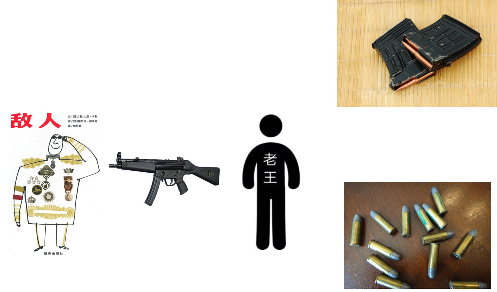

## 应用：老王开枪




###1. 人类

* 属性
 * 姓名
 * 血量
 * 持有的枪
* 方法
 * 安子弹
 * 安弹夹
 * 拿枪（持有抢）
 * 开枪


###2. 子弹类

* 属性
 * 杀伤力
* 方法
 * 伤害敌人(让敌人掉血)


###3. 弹夹类

* 属性
 * 容量（子弹存储的最大值）
 * 当前保存的子弹
* 方法
 * 保存子弹（安装子弹的时候）
 * 弹出子弹（开枪的时候）


###4. 枪类

* 属性
 * 弹夹（默认没有弹夹，需要安装）
* 方法
 * 连接弹夹（保存弹夹）
 * 射子弹


### 参考代码

```python
class Person(object):
    """定义一个人类"""
    def __init__(self, new_name):
        """完成对一个人对象的初始化后"""
        self.name = new_name
        self.gun = None # 用来存储枪对象的引用
        self.hp = 100 # 记录人的血量

    def __str__(self):
        """返回人对象的描述信息"""
        if self.gun:
            return "%s剩余血量是:%d 有枪, %s" % (self.name, self.hp, self.gun)
        else:
            if self.hp == 0:
                return "%s已经挂了....." % self.name
            else:
                return "%s剩余血量是:%d 没有枪" % (self.name, self.hp)

    def install_bullet_2_clip(self, bullet_temp, clip_temp):
        """安装子弹到弹夹中"""
        # 弹夹.保存(子弹)
        clip_temp.save_bullet(bullet_temp)

    def install_clip_2_gun(self, clip_temp, gun_temp):
        """安装弹夹到枪中"""
        # 枪.保存(弹夹)
        gun_temp.save_clip(clip_temp)

    def get_gun(self, gun_temp):
        """让人拿起枪"""
        self.gun = gun_temp

    def pull_trigger(self, enemy_temp):
        """让枪发射子弹射向敌人"""
        # 枪.发射(敌人)
        self.gun.fire(enemy_temp)

    def lose_hp(self, power_temp):
        """敌人掉血"""
        self.hp -= power_temp
        if self.hp < 0:
            self.hp = 0


class Gun(object):
    """定一个枪类"""
    def __init__(self, new_name):
        """完成对枪对象的初始化"""
        self.name = new_name
        self.clip = None # 用来存储这个枪中的弹夹

    def __str__(self):
        """返回这个枪对象的描述信息"""
        # 因为下面的代码中需要获取self.clip指向的对象的描述信息，因此
        # self.clip指向的对象中的__str__方法会被自动调用
        return  "枪(%s)里有弹夹，%s" % (self.name, self.clip)

    def save_clip(self, clip_temp):
        """保存弹夹"""
        self.clip = clip_temp

    def fire(self, enemy_temp):
        """向敌人发射一颗子弹"""
        # 让弹夹弹出一颗子弹
        # 弹夹.弹出一颗子弹()
        bullet = self.clip.pop_bullet()
        if bullet:
            # 让子伤害敌人
            # 子弹.掉血(敌人)
            bullet.hit_enemy(enemy_temp)
        else:
            print("%s中没有子弹了" % self.name)


class Clip(object):
    """定义一个弹夹类"""
    def __init__(self, new_max):
        """完成弹夹对象的初始化"""
        self.max = new_max
        self.bullets = []  # 用来存储所有的子弹的引用

    def __str__(self):
        """返回弹夹的描述信息"""
        return "弹夹的信息是: (%d/%d)" % (len(self.bullets), self.max)

    def save_bullet(self, bullet_temp):
        """保存这个一颗子弹"""
        self.bullets.append(bullet_temp)

    def pop_bullet(self):
        """返回最上面的一颗子弹"""
        if self.bullets:
            bullet = self.bullets.pop()
            return bullet
        else:
            return None


class Bullet(object):
    """定一个子弹类"""
    def __init__(self, new_power):
        """完成对子弹对象的初始化"""
        self.power = new_power  # 子弹的威力

    def hit_enemy(self, enemy_temp):
        """让敌人掉血"""
        # 敌人.掉血()
        enemy_temp.lose_hp(self.power)


def main():
    """完成整个程序的控制"""
    # 创建老王对象
    lao_wang = Person("老王")

    # 创建一个枪
    ak47 = Gun("AK47")

    # 创建一个子弹
    bullet = Bullet(20)  # 20表示杀伤力

    # 创建一个弹夹
    clip = Clip(10)  # 10表示这个弹夹最大的容量

    # 让老王把子弹安装到弹夹中
    # 老王.安装子弹(子弹， 弹夹)
    lao_wang.install_bullet_2_clip(bullet, clip)

    # 让老王把弹夹安装到枪中
    # 老王.安装弹夹(弹夹，枪)
    lao_wang.install_clip_2_gun(clip, ak47)

    # 测试枪的信息
    # print(ak47)

    # 老王拿起枪
    # 老王.拿起(枪)
    lao_wang.get_gun(ak47)
    print(lao_wang)

    # 创建一个敌人
    enemy = Person("隔壁老宋")

    # 老王向敌人扣扳机
    # 老王.扣扳机(敌人)
    lao_wang.pull_trigger(enemy)
    print(enemy)

    lao_wang.pull_trigger(enemy)
    print(enemy)

    bullet = Bullet(30)
    lao_wang.install_bullet_2_clip(bullet, clip)

    bullet = Bullet(90)
    lao_wang.install_bullet_2_clip(bullet, clip)

    lao_wang.pull_trigger(enemy)
    print(enemy)
    lao_wang.pull_trigger(enemy)
    print(enemy)

if __name__ == '__main__':
    main()

```
