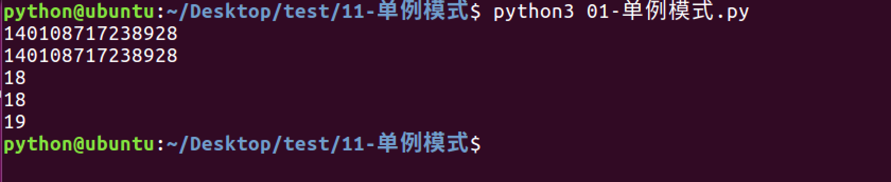

## 单例模式

### 1. 单例是什么

举个常见的单例模式例子，我们日常使用的电脑上都有一个回收站，在整个操作系统中，回收站只能有一个实例，整个系统都使用这个唯一的实例，而且回收站自行提供自己的实例。因此回收站是单例模式的应用。

确保某一个类只有一个实例，而且自行实例化并向整个系统提供这个实例，这个类称为单例类，单例模式是一种对象创建型模式。

### 2. 创建单例-保证只有1个对象

```python

# 实例化一个单例
class Singleton(object):
    __instance = None

    def __new__(cls, age, name):
        #如果类属性__instance的值为None，
        #那么就创建一个对象，并且赋值为这个对象的引用，保证下次调用这个方法时
        #能够知道之前已经创建过对象了，这样就保证了只有1个对象
        if not cls.__instance:
            cls.__instance = object.__new__(cls)
        return cls.__instance

a = Singleton(18, "dongGe")
b = Singleton(8, "dongGe")

print(id(a))
print(id(b))

a.age = 19 #给a指向的对象添加一个属性
print(b.age)#获取b指向的对象的age属性

```

运行结果：

```python
In [12]: class Singleton(object):
    ...:     __instance = None
    ...: 
    ...:     def __new__(cls, age, name):
    ...:         if not cls.__instance:
    ...:             cls.__instance = object.__new__(cls)
    ...:         return cls.__instance
    ...: 
    ...: a = Singleton(18, "dongGe")
    ...: b = Singleton(8, "dongGe")
    ...: 
    ...: print(id(a))
    ...: print(id(b))
    ...: 
    ...: a.age = 19
    ...: print(b.age)
    ...: 
4391023224
4391023224
19
```

### 3. 创建单例时，只执行1次\_\_init\_\_方法
```python

# 实例化一个单例
class Singleton(object):
    __instance = None
    __is_first = True

    def __new__(cls, age, name):
        if not cls.__instance:
            cls.__instance = object.__new__(cls)
        return cls.__instance

    def __init__(self, age, name):
        if self. __is_first:
            self.age = age
            self.name = name
            Singleton. __is_first = False


a = Singleton(18, "习大大")
b = Singleton(28, "习大大")

print(id(a))
print(id(b))


print(a.age)
print(b.age)

a.age = 19
print(b.age)

```

运行结果:


