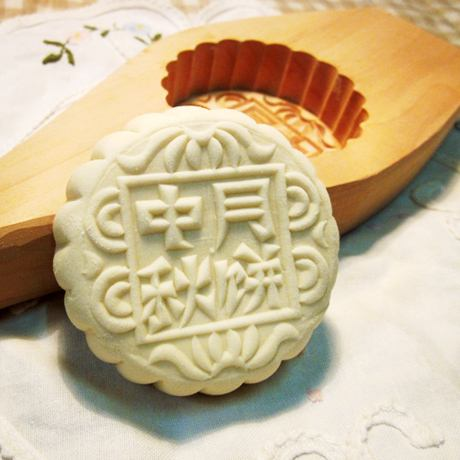

## 创建对象

python中，可以根据已经定义的类去创建出一个或多个对象。

创建对象的格式为:

```python
对象名1 = 类名()
对象名2 = 类名()
对象名3 = 类名()
```

创建对象demo:

``` python
class Hero(object):  # 新式类定义形式
    """info 是一个实例方法，类对象可以调用实例方法，实例方法的第一个参数一定是self"""
    def info(self):
        """当对象调用实例方法时，Python会自动将对象本身的引用做为参数，
            传递到实例方法的第一个参数self里"""
        print(self) 
        print("self各不同，对象是出处。")


# Hero这个类 实例化了一个对象  taidamier(泰达米尔)
taidamier = Hero()

# 对象调用实例方法info()，执行info()里的代码
# . 表示选择属性或者方法
taidamier.info()

print(taidamier)  # 打印对象，则默认打印对象在内存的地址，结果等同于info里的print(self)
print(id(taidamier))  # id(taidamier) 则是内存地址的十进制形式表示


```

#### 说明：
* 当创建一个对象时，就是用一个模子，来制造一个实物
 


#### 问题：
> 对象既然有实例方法，是否也可以有自己的属性?
