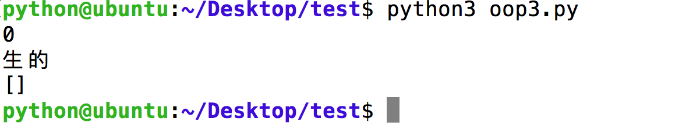
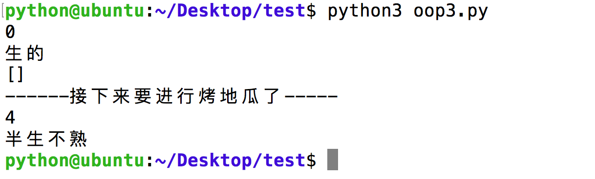
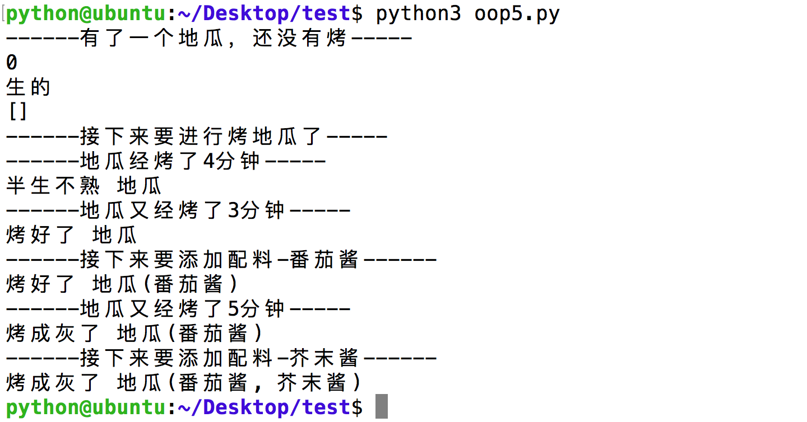

# 应用:烤地瓜

为了更好的理解面向对象编程，下面以“烤地瓜”为案例，进行分析


## 1.分析“烤地瓜”的属性和方法

### 示例属性如下:
* cookedLevel : 这是数字；0~3表示还是生的，超过3表示半生不熟，超过5表示已经烤好了，超过8表示已经烤成木炭了！我们的地瓜开始时时生的
* cookedString : 这是字符串；描述地瓜的生熟程度
* condiments : 这是地瓜的配料列表，比如番茄酱、芥末酱等

### 示例方法如下:
* `cook()` : 把地瓜烤一段时间
* `addCondiments()` : 给地瓜添加配料
* `__init__()` : 设置默认的属性
* `__str__()` : 让print的结果看起来更好一些

## 2. 定义类，并且定义`__init__()`方法

```python
#定义`地瓜`类
class SweetPotato:
	"""这是烤地瓜的类"""
	
	#定义初始化方法
	def __init__(self):
		self.cookedLevel = 0
		self.cookedString = "生的"
		self.condiments = []

```


## 3. 添加"烤地瓜"方法

```python
	#烤地瓜方法
	def cook(self, time):
		self.cookedLevel += time
		if self.cookedLevel > 8:
			self.cookedString = "烤成灰了"
		elif self.cookedLevel > 5:
			self.cookedString = "烤好了"	
		elif self.cookedLevel > 3:
			self.cookedString = "半生不熟"
		else:
			self.cookedString = "生的"

```


## 4. 基本的功能已经有了一部分，赶紧测试一下

把上面2块代码合并为一个程序后，在代码的下面添加以下代码进行测试

```python
mySweetPotato = SweetPotato()
print(mySweetPotato.cookedLevel)
print(mySweetPotato.cookedString)
print(mySweetPotato.condiments)
```

完整的代码为:

```python
class SweetPotato:
	"""这是烤地瓜的类"""
	
	# 定义初始化方法
	def __init__(self):
		self.cookedLevel = 0
		self.cookedString = "生的"
		self.condiments = []

	# 烤地瓜方法
	def cook(self, time):
		self.cookedLevel += time
		if self.cookedLevel > 8:
			self.cookedString = "烤成灰了"
		elif self.cookedLevel > 5:
			self.cookedString = "烤好了"	
		elif self.cookedLevel > 3:
			self.cookedString = "半生不熟"
		else:
			self.cookedString = "生的"

# 用来进行测试
mySweetPotato = SweetPotato()
print(mySweetPotato.cookedLevel)
print(mySweetPotato.cookedString)
print(mySweetPotato.condiments)

```




## 5. 测试cook方法是否好用

在上面的代码最后面添加如下代码:

```python
print("------接下来要进行烤地瓜了-----")
mySweetPotato.cook(4) #烤4分钟
print(mySweetPotato.cookedLevel)
print(mySweetPotato.cookedString)
```




## 6. 定义`addCondiments()`方法和`__str__()`方法

```python

	def __str__(self):
		msg = self.cookedString + " 地瓜"
		if len(self.condiments) > 0:
			msg = msg + "("
			for temp in self.condiments:
				msg = msg + temp + ", "
			msg = msg.strip(", ")

			msg = msg + ")"
		return msg

	def addCondiments(self, condiments):
		self.condiments.append(condiments)
```

## 7. 再次测试

完整的代码如下:


```python

class SweetPotato:
	"""这是烤地瓜的类"""
	
	# 定义初始化方法
	def __init__(self):
		self.cookedLevel = 0
		self.cookedString = "生的"
		self.condiments = []

	# 定制print时的显示内容
	def __str__(self):
		msg = self.cookedString + " 地瓜"
		if len(self.condiments) > 0:
			msg = msg + "("

			for temp in self.condiments:
				msg = msg + temp + ", "
			msg = msg.strip(", ")

			msg = msg + ")"
		return msg

	# 烤地瓜方法
	def cook(self, time):
		self.cookedLevel += time
		if self.cookedLevel > 8:
			self.cookedString = "烤成灰了"
		elif self.cookedLevel > 5:
			self.cookedString = "烤好了"	
		elif self.cookedLevel > 3:
			self.cookedString = "半生不熟"
		else:
			self.cookedString = "生的"

	# 添加配料
	def addCondiments(self, condiments):
		self.condiments.append(condiments)

# 用来进行测试
mySweetPotato = SweetPotato()
print("------有了一个地瓜，还没有烤-----")
print(mySweetPotato.cookedLevel)
print(mySweetPotato.cookedString)
print(mySweetPotato.condiments)
print("------接下来要进行烤地瓜了-----")
print("------地瓜经烤了4分钟-----")
mySweetPotato.cook(4) #烤4分钟
print(mySweetPotato)
print("------地瓜又经烤了3分钟-----")
mySweetPotato.cook(3) #又烤了3分钟
print(mySweetPotato)
print("------接下来要添加配料-番茄酱------")
mySweetPotato.addCondiments("番茄酱")
print(mySweetPotato)
print("------地瓜又经烤了5分钟-----")
mySweetPotato.cook(5) #又烤了5分钟
print(mySweetPotato)
print("------接下来要添加配料-芥末酱------")
mySweetPotato.addCondiments("芥末酱")
print(mySweetPotato)
```

