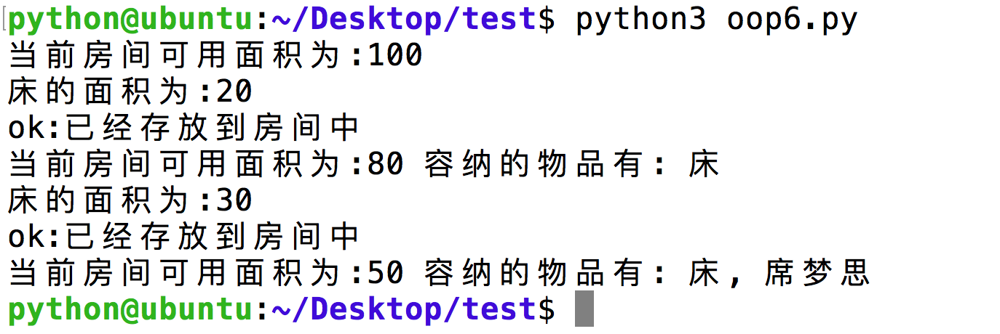

## 应用:存放家具

### 代码实现

```python
# 定义一个home类
class Home:
    
    def __init__(self, area):
        self.area = area #房间剩余的可用面积
        # self.light = 'on' #灯默认是亮的
        self.containsItem = []

    def __str__(self):
        msg = "当前房间可用面积为:" + str(self.area)
        if len(self.containsItem) > 0:
            msg = msg + " 容纳的物品有: "
            for temp in self.containsItem:
                msg = msg + temp.getName() + ", "
            msg = msg.strip(", ")
        return msg

    # 容纳物品
    def accommodateItem(self,item):
        # 如果可用面积大于物品的占用面积
        needArea = item.getUsedArea()
        if self.area > needArea:
            self.containsItem.append(item)
            self.area -= needArea
            print("ok:已经存放到房间中")
        else:
            print("err:房间可用面积为:%d,但是当前要存放的物品需要的面积为%d"%(self.area, needArea))


# 定义bed类
class Bed:
    
    def __init__(self,area,name = '床'):
        self.name = name
        self.area = area

    def __str__(self):
        msg = '床的面积为:' + str(self.area)
        return msg

    # 获取床的占用面积
    def getUsedArea(self):
        return self.area

    def getName(self):
        return self.name


# 创建一个新家对象
newHome = Home(100)#100平米
print(newHome)

# 创建一个床对象
newBed = Bed(20)
print(newBed)

# 把床安放到家里
newHome.accommodateItem(newBed)
print(newHome)

# 创建一个床对象
newBed2 = Bed(30,'席梦思')
print(newBed2)

# 把床安放到家里
newHome.accommodateItem(newBed2)
print(newHome)
```



#### 总结：
* 如果一个对象与另外一个对象有一定的关系，那么一个对象可用是另外一个对象的属性

#### 思维升华：
* 添加“开、关”灯，让房间、床一起亮、灭

