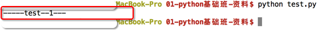
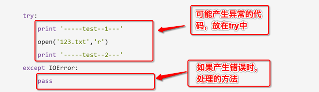
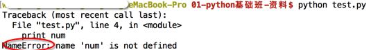
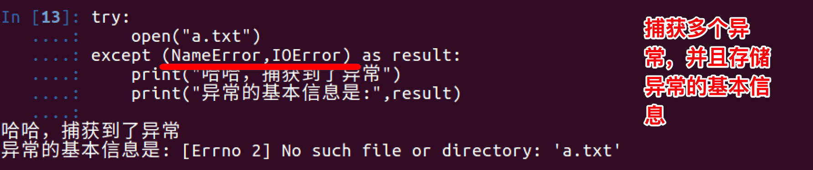
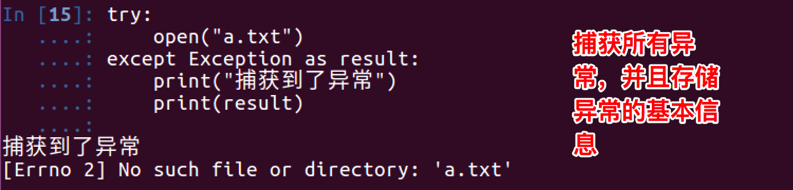
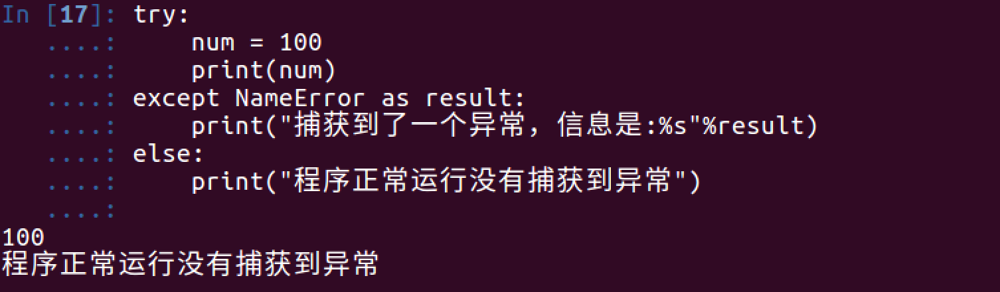

# 案例剖析

## 1. 捕获异常 try...except...

看如下示例:
```python

try:
	print('-----test--1---')
	open('123.txt','r')
	print('-----test--2---')
except IOError:
	pass
```

运行结果:




说明:
* 此程序看不到任何错误，因为用except 捕获到了IOError异常，并添加了处理的方法
* pass 表示实现了相应的实现，但什么也不做；如果把pass改为print语句，那么就会输出其他信息


小总结:

* 
* 把可能出现问题的代码，放在try中
* 把处理异常的代码，放在except中

## 2. except捕获多个异常

看如下示例:
```python

try:
    print num
except IOError:
    print('产生错误了')

```

运行结果如下:




想一想:
> 上例程序，已经使用except来捕获异常了，为什么还会看到错误的信息提示？

答:
> except捕获的错误类型是IOError，而此时程序产生的异常为 NameError ，所以except没有生效

修改后的代码为:
```python

try:
    print num
except NameError:
    print('产生错误了')

```

运行结果如下:


####实际开发中，捕获多个异常的方式，如下：


```python
#coding=utf-8
try:
    print('-----test--1---')
    open('123.txt','r') # 如果123.txt文件不存在，那么会产生 IOError 异常
    print('-----test--2---')
    print(num)# 如果num变量没有定义，那么会产生 NameError 异常

except (IOError,NameError): 
    #如果想通过一次except捕获到多个异常可以用一个元组的方式
```

### 注意：
* 当捕获多个异常时，可以把要捕获的异常的名字，放到except 后，并使用元组的方式仅进行存储


## 3. 获取异常的信息描述




## 4. 捕获所有异常





## 5. else

咱们应该对`else`并不陌生，在if中，它的作用是当条件不满足时执行的实行；同样在try...except...中也是如此，即如果没有捕获到异常，那么就执行else中的事情

```python

try:
    num = 100
    print num
except NameError as errorMsg:
    print('产生错误了:%s'%errorMsg)
else:
    print('没有捕获到异常，真高兴')

```

运行结果如下:



## 6. try...finally...

try...finally...语句用来表达这样的情况：
> 在程序中，如果一个段代码必须要执行，即无论异常是否产生都要执行，那么此时就需要使用finally。
> 比如文件关闭，释放锁，把数据库连接返还给连接池等

demo:
```python
	
import time
try:
    f = open('test.txt')
    try:
        while True:
            content = f.readline()
            if len(content) == 0:
                break
            time.sleep(2)
            print(content)
    except:
        #如果在读取文件的过程中，产生了异常，那么就会捕获到
        #比如 按下了 ctrl+c
        pass
    finally:
        f.close()
        print('关闭文件')
except:
    print("没有这个文件")
```

说明:
>test.txt文件中每一行数据打印，但是我有意在每打印一行之前用time.sleep方法暂停2秒钟。这样做的原因是让程序运行得慢一些。在程序运行的时候，按Ctrl+c中断（取消）程序。
>
>我们可以观察到KeyboardInterrupt异常被触发，程序退出。但是在程序退出之前，finally从句仍然被执行，把文件关闭。


