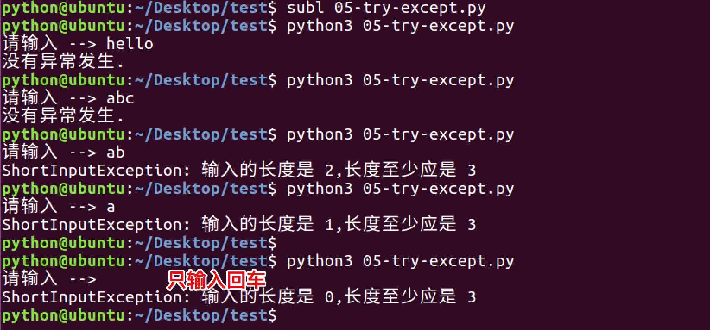

# 抛出自定义的异常

你可以用raise语句来引发一个异常。异常/错误对象必须有一个名字，且它们应是Error或Exception类的子类

下面是一个引发异常的例子:

```python

class ShortInputException(Exception):
    '''自定义的异常类'''
    def __init__(self, length, atleast):
        #super().__init__()
        self.length = length
        self.atleast = atleast

def main():
    try:
        s = input('请输入 --> ')
        if len(s) < 3:
            # raise引发一个你定义的异常
            raise ShortInputException(len(s), 3)
    except ShortInputException as result:#x这个变量被绑定到了错误的实例
        print('ShortInputException: 输入的长度是 %d,长度至少应是 %d'% (result.length, result.atleast))
    else:
        print('没有异常发生.')

main()

```

运行结果如下:



### 注意
* 以上程序中，关于代码`#super().__init__()`的说明
> 这一行代码，可以调用也可以不调用，建议调用，因为`__init__`方法往往是用来对创建完的对象进行初始化工作，如果在子类中重写了父类的`__init__`方法，即意味着父类中的很多初始化工作没有做，这样就不保证程序的稳定了，所以在以后的开发中，如果重写了父类的`__init__`方法，最好是先调用父类的这个方法，然后再添加自己的功能