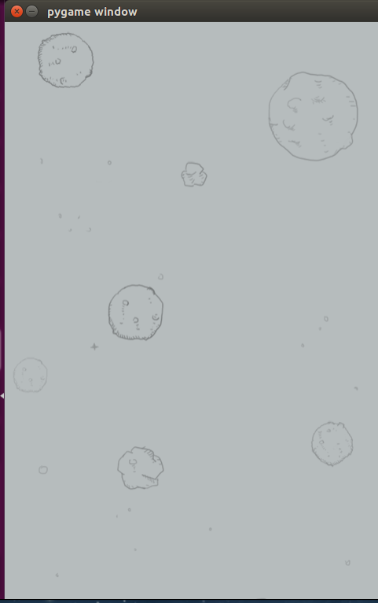

# 飞机大战代码：搭建界面



```python
#coding=utf-8
import pygame

'''
    1. 搭建界面，主要完成窗口和背景图的显示
'''

def main():

    #1. 创建一个窗口，用来显示内容
    screen = pygame.display.set_mode((480,852),0,32)

    #2. 创建一个和窗口大小的图片，用来充当背景
    background = pygame.image.load("./feiji/background.png")

    #3. 把背景图片放到窗口中显示
    while True:

        #设定需要显示的背景图
        screen.blit(background,(0,0))

        #更新需要显示的内容
        pygame.display.update()

if __name__ == "__main__":

	main()


```